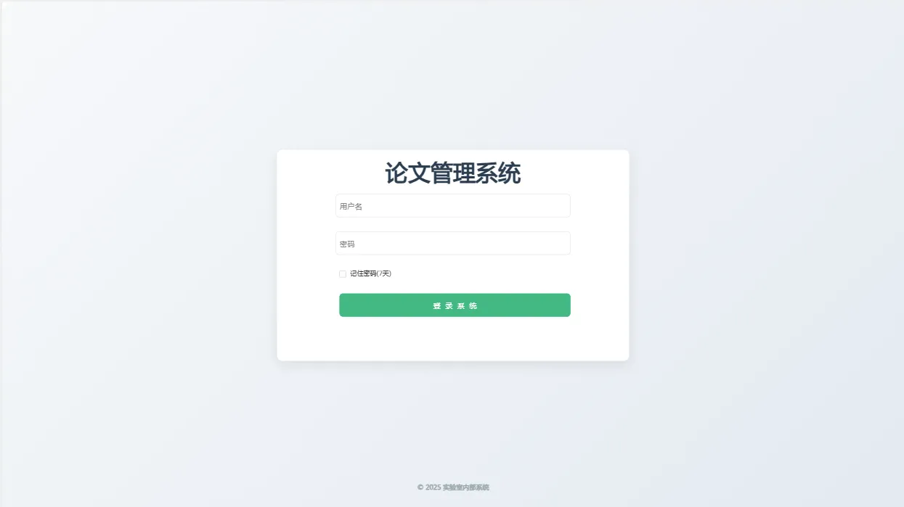
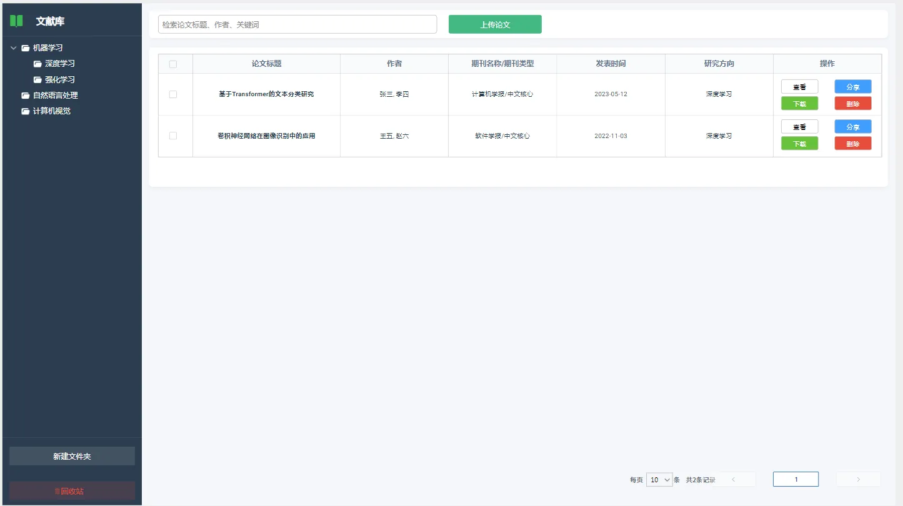
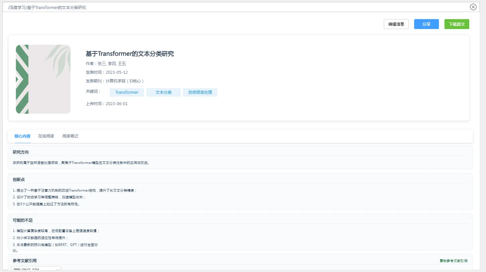
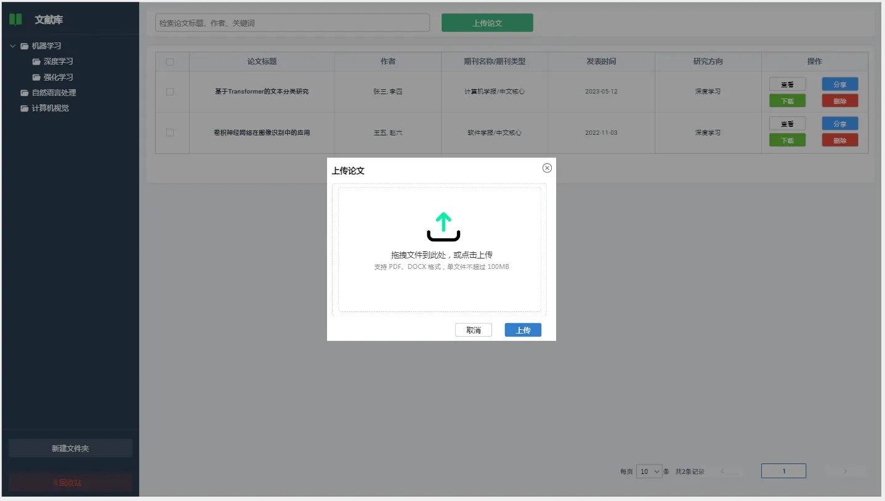
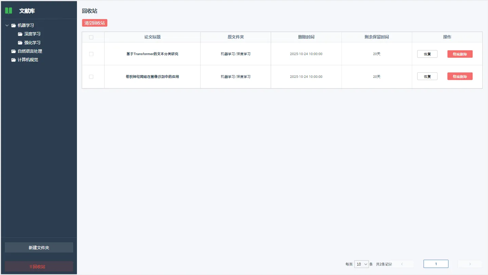

## 项目简介
该项目是专为实验室内部设计的论文管理系统，旨在解决学术文献管理混乱、归纳效率低、分享不便等问题。系统支持论文上传、智能信息提取、分类管理、多格式引用生成等核心功能，结合大语言模型辅助归纳论文创新点与不足，助力科研团队高效管理文献资源。

## 核心功能
### 📦 论文全生命周期管理
+ **上传与解析**：支持 PDF/CAJ/DOCX 格式上传，自动提取标题、作者、期刊等元数据，减少手动录入
+ **详情与编辑**：可视化展示论文核心信息（研究方向、创新点等），支持手动修改与补充
+ **下载与分享**：单文件/批量下载，支持自定义分享权限（仅查看 / 允许下载）与有效期
+ **删除与恢复**：删除论文自动移入回收站（保留 30 天），支持一键恢复或彻底删除

### 🧠 智能辅助归纳
+ 集成大语言模型 API，自动归纳论文研究方向、创新点及可能的不足
+ 保留归纳历史版本，支持用户对比优化

### 📂 分类与搜索
+ 多级文件夹分类，支持论文批量移动与多文件夹归属
+ 多维度搜索（标题 / 作者 / 关键词 / 研究方向），快速定位目标文献

### 📝 引用与笔记
+ 内置国标 GB/T 7714、APA、IEEE 等常见引用格式，一键生成并复制
+ 支持自定义引用模板，满足个性化需求
+ 富文本阅读笔记，关联论文永久保存

### 👥 基础用户管理
+ 支持用户创建、密码修改、登录状态管理
+ 局域网内轻量使用，无需复杂权限配置

## 技术栈
### 前端
+ 框架：Vue3 + TypeScript
+ 构建工具：Vite3
+ UI 组件库：Element Plus
+ 状态管理：Pinia
+ 路由：Vue Router

### 后端
+ 语言：Java 17
+ 框架：Spring Boot 3
+ 认证：Sa-Token
+ ORM：MyBatis-Plus
+ 数据库：MySQL 8.0
+ 缓存：Redis 6.2
+ 连接池：Druid

## 快速开始
### 环境准备
+ 前端：Node.js 22、npm
+ 后端：JDK 17、MySQL 8.0、Redis 6.2

### 项目克隆
```bash
git clone https://github.com/wzyzxl/thesis_management_system.git
cd thesis_management_system
```

### 后端启动
1. 导入`sql`目录下的数据库脚本
2. 修改`application.yml`配置数据库、Redis 连接信息
3. 运行`ThesisManagementSystemApplication.java`启动类

### 前端启动
```bash
cd frontend
npm install
npm run dev
```

### 访问系统
+ 前端地址：[http://localhost:5173](http://localhost:5173/)
+ 初始账号：admin 初始密码：admin@123

## 目录结构
```plain
LabPaperManager/
├── backend/                # 后端项目
│   ├── src/main/java/com/laboratory/paper/
│   │   ├── controller/     # 接口控制层
│   │   ├── service/        # 业务逻辑层
│   │   ├── mapper/         # 数据访问层
│   │   ├── entity/         # 实体类
│   │   ├── domain/         # 实体类
│   │   ├── vo/         		# 实体类
│   │   ├── config/         # 配置类
│   │   └── utils/          # 工具类
│   └── src/main/resources/
│       ├── application.yml # 全局配置
├── frontend/               # 前端项目
│   ├── src/
│   │   ├── components/     # 公共组件
│   │   ├── views/          # 页面组件
│   │   ├── router/         # 路由配置
│   │   ├── store/          # 状态管理
│   │   ├── utils/          # 工具函数
│   │   └── assets/         # 静态资源
│   └── vite.config.ts      # 构建配置
└── images                  # 项目级别图片
└── docs                    # 相关文档
└── sql                     # 数据库脚本
└── LICENSE                 # 许可证
└── README.md               # 项目说明文档
```

## 使用说明
### 1. 论文上传
1. 点击首页「上传论文」按钮，进入上传页面
2. 拖拽或选择 PDF/CAJ/DOCX 文件，系统自动提取基础信息
3. 补充关键词、归属文件夹等信息，点击「确认上传」
4. 上传完成后可在论文列表查看

### 2. 论文管理
+ **编辑信息**：进入论文详情页，点击「编辑」按钮修改基础信息及核心归纳内容
+ **分类管理**：在论文列表勾选论文，点击「批量移动」选择目标文件夹
+ **删除操作**：点击「删除」按钮，论文移入回收站，可在回收站恢复或彻底删除

### 3. 论文分享
1. 在论文详情页点击「分享」按钮
2. 选择分享内容（完整论文 / 仅核心内容）、访问权限（仅查看 / 允许下载）、有效期
3. 生成分享链接，支持复制链接或下载二维码
4. 分享记录可在「分享管理」页面查看与取消

### 4. 引用生成
1. 进入论文详情页「核心内容」标签页
2. 选择目标引用格式（如国标 GB/T 7714、APA）
3. 系统自动生成引用文本，点击「复制」即可用于论文写作

## 界面展示
### 登录页


### 首页（论文列表）


### 论文详情页


### 上传页面


### 回收站页面
## 

## 文档说明
1. [论文管理系统需求文档](./docs/论文管理系统需求文档.md)
2. [论文管理系统设计文档](./docs/论文管理系统设计文档.md)
3. [论文管理系统API文档](./docs/论文管理系统API文档.md)

## 高保真原型
[墨刀原型](https://modao.cc/proto/MNGmQdODt4etpl0sMJ4Qml/sharing?view_mode=read_only&screen=rbpV0F5APt8nmfUvD)

## 许可证
本项目基于[MIT License](/LICENSE)开源，仅供实验室内部学习与使用。